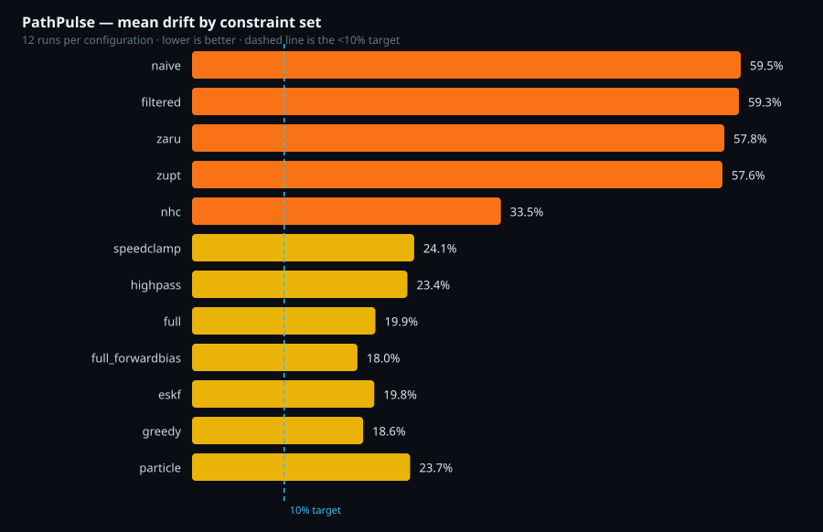

# PathPulse benchmarks

**Generated by `pnpm ablation`. Do not edit by hand — rerun it.**

12 runs per configuration: 4 logs × 3 outage windows.
Ground truth is each log's own recorded GNSS, withheld from the estimator over
the outage window. Road graphs used: city, highway.

> ⚠️ **Every log here is SIMULATED** (`sim_*.jsonl`), not driven. These numbers
> measure the estimator against a physics model, not against a road. Real drive
> logs belong alongside them as `drive_*.jsonl`; until then, do not present any
> figure in this file as a road result.

## Drift

| Configuration | Mean % | Median % | p90 % | Max % | RMSE m | Along m | Cross m | CEP95 m |
|---|---|---|---|---|---|---|---|---|
| naive | **59.5** | 57.9 | 80.9 | 81.1 | 348.3 | 297.5 | 173.7 | 600.4 |
| filtered | **59.3** | 57.9 | 80.9 | 81.0 | 347.2 | 295.1 | 175.2 | 598.1 |
| zaru | **57.7** | 50.5 | 81.7 | 81.9 | 346.1 | 299.8 | 165.3 | 597.2 |
| zupt | **57.5** | 52.3 | 76.5 | 77.3 | 342.2 | 300.4 | 156.5 | 590.6 |
| nhc | **33.5** | 34.7 | 52.6 | 57.5 | 170.3 | 146.5 | 71.3 | 317.6 |
| speedclamp | **30.2** | 34.7 | 52.6 | 57.5 | 152.6 | 128.4 | 69.9 | 265.3 |
| highpass | **14.6** | 16.6 | 25.9 | 27.5 | 92.0 | 71.7 | 49.7 | 150.1 |
| full | **9.2** | 5.3 | 22.6 | 28.2 | 71.4 | 57.4 | 39.6 | 118.4 |
| full_forwardbias | **13.3** | 14.5 | 21.6 | 26.8 | 85.2 | 71.2 | 41.8 | 152.4 |
| eskf | **10.1** | 8.5 | 19.4 | 25.0 | 80.5 | 62.2 | 46.2 | 135.3 |
| hmm | **10.5** | 7.0 | 25.1 | 30.5 | 73.4 | 59.8 | 39.5 | 126.2 |



## Behaviour

| Configuration | Recovery s | Update Hz | ZUPT | Road snap % | Resets |
|---|---|---|---|---|---|
| naive | 1.02 | 50.0 | 0 | 0.0 | 10 |
| filtered | 1.02 | 50.0 | 0 | 0.0 | 10 |
| zaru | 1.02 | 50.0 | 0 | 0.0 | 10 |
| zupt | 1.02 | 50.0 | 18 | 0.0 | 10 |
| nhc | 14.75 | 50.0 | 18 | 0.0 | 0 |
| speedclamp | 14.50 | 50.0 | 18 | 0.0 | 0 |
| highpass | 8.68 | 50.0 | 18 | 0.0 | 0 |
| full | 6.29 | 50.0 | 18 | 99.7 | 0 |
| full_forwardbias | 7.59 | 50.0 | 18 | 100.0 | 0 |
| eskf | 6.85 | 50.0 | 18 | 99.2 | 0 |
| hmm | 6.29 | 50.0 | 18 | 99.7 | 0 |

## What each row is

- **naive** — Double integration and nothing else. The baseline the whole project exists to beat.
- **filtered** — + median and low-pass filters. Removes pothole spikes and engine vibration.
- **zaru** — + ZARU. A stopped vehicle's gyro reading is pure bias, so every stop calibrates it free.
- **zupt** — + ZUPT. A stopped vehicle has exactly zero velocity, and every red light resets the error budget.
- **nhc** — + NHC. A vehicle does not slide sideways, so lateral velocity is error by construction.
- **speedclamp** — + plausibility ceiling and the decay of a stale unaided estimate.
- **highpass** — + acceleration high-pass. Real longitudinal acceleration averages to zero over a minute; tilt error does not. Largest single improvement in the table.
- **full** — Everything that earns its place, including road snapping. This is what ships.
- **full_forwardbias** — NEGATIVE RESULT, kept deliberately. Full plus the GNSS-Doppler forward-bias estimator, which measurably WORSENS drift now that the high-pass exists. Reported rather than deleted.
- **eskf** — Phase 11. The shipped configuration, with position taken from the 15-state error-state Kalman filter while dead reckoning instead of from open-loop integration. Everything else identical to `full`.
- **hmm** — Phase 14. The shipped configuration, with the matched road chosen by a Newson-Krumm HMM over a sliding window instead of nearest-road-plus-continuity. Everything else identical to `full`.

## Reading this table

**Along-track and cross-track are separated on purpose.** A single error figure
says how wrong the estimate is; the split says *how* it is wrong, and the two
have different causes and different fixes. Cross-track error is what puts the
marker inside a building, and road geometry bounds it. Along-track error leaves
the marker on the right road at the wrong point along it, comes from speed
error, and road snapping deliberately does nothing about it.

**Drift % is final error over distance actually travelled**, taken from ground
truth rather than from the estimate's own idea of how far it went — otherwise a
configuration that under-estimates its speed would flatter itself twice.

**The p90 and max columns matter more than the mean.** A good mean hiding a bad
tail is exactly what someone finds by picking the one drive that went wrong.

## Reproducing

```bash
pnpm eval:record     # regenerate the simulated logs (deterministic)
pnpm ablation        # rerun every configuration over every log
pnpm eval -- --log sim_city_4242.jsonl --config full   # one run, in detail
```

The engine is deterministic — the same samples in produce byte-identical states
out, which nav-core's invariant tests assert — so these numbers reproduce
exactly on any machine.
