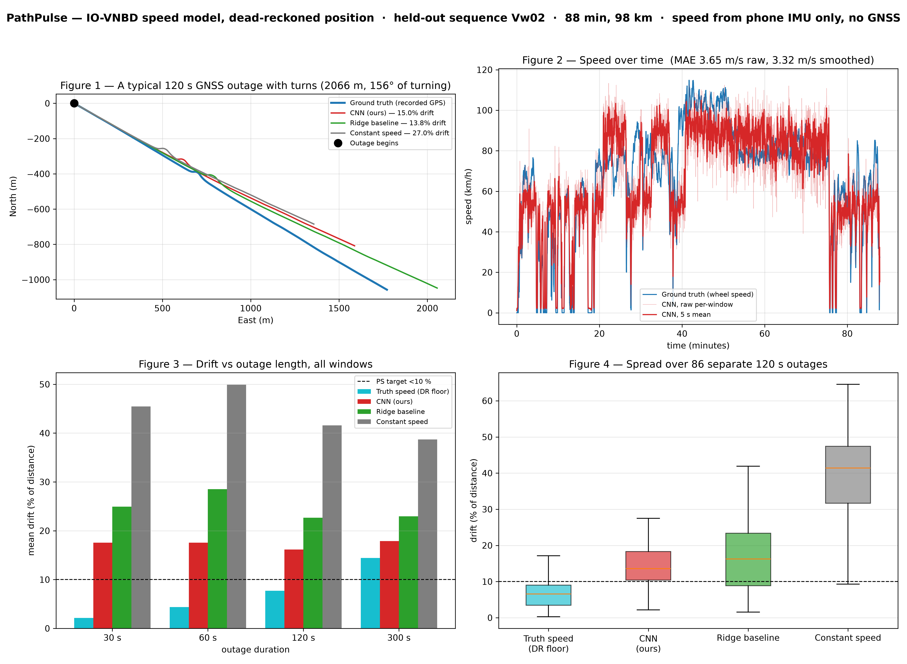

# ML — IO-VNBD speed model (Phase 8)

A 1D-CNN that reads two seconds of a phone's accelerometer and gyroscope and
answers with the vehicle's speed. It exists because dead reckoning's hardest
problem is not direction, it is **speed**: an accelerometer cannot tell a parked
car from one cruising at a steady 50 km/h, so integrating it during a GNSS
outage has no reference and no bound on its error.

The problem statement requires this work as a screening artefact:

> "Teams are required to include the preliminary AI models and the results of
> the position plot inferenced from the subset of IO-VNBD dataset as part of
> their proposals submitted for evaluation."

**The artefact is [`results/position_plot.png`](results/position_plot.png).**

## Reproduce

```bash
./ml/run_all.sh          # venv, download, preprocess, train, evaluate, export
```

Everything is seeded (`config.py: SEED = 1337`). Network is needed only for the
download step. Total runtime is a few minutes on an M-series Mac; training is
about 60 s on MPS.

## The dataset

[IO-VNBD](https://github.com/onyekpeu/IO-VNBD) — a UK/Nigeria/France ground
vehicle dataset. Each sequence is a **matched, row-synchronised pair**:

| file | what it is | our use |
| --- | --- | --- |
| `S-<seq>.csv` | the **smartphone**: accelerometer m/s², gyroscope rad/s, GPS | the **input** |
| `V-<seq>.csv` | the **vehicle** CAN bus: wheel speed, yaw rate, steering, gears | the **label** |

That pairing is why this dataset fits PathPulse exactly. The input is a phone's
IMU — the sensor we actually deploy on — and the label is the car's own
**wheel-speed sensor**, not GPS. Using GPS speed as the label would mean
training against a teacher that goes silent in precisely the situation the model
exists to serve. Wheel odometry does not.

The files live in Git LFS, so `raw.githubusercontent` serves 132-byte pointers.
`data/download.py` resolves them through the LFS batch API and fetches only the
sequences asked for, rather than cloning 40 hours of driving.

**27 sequences, 15.6 hours, 10 Hz.**

## Deviations from the build guide, and why

| guide says | we did | why |
| --- | --- | --- |
| resample to 50 Hz, 100-sample window | **10 Hz, 20-sample window** | IO-VNBD's phone log *is* 10 Hz. Upsampling would make 80 of every 100 samples interpolation — no information above 5 Hz exists to recover. The window is still 2 s, which is what matters, and the app decimates to match. |
| Conv/pool stack unpadded | same layers, `padding='same'` | Two unpadded pools on 20 samples leave 2 timesteps before a kernel of 3. It would not run. |
| 36 statistical features | **42** | The guide lists seven statistics across six axes. 7 × 6 = 42; the list won over the arithmetic. |
| export ONNX **and** TFLite | **ONNX + a pure-TS runtime** | ONNX Runtime needs 14 MB of WASM to evaluate 26081 parameters — the APK would go from 5.4 MB to ~20 MB — and it fails Next's Terser pass. nav-core evaluates the network itself instead. ONNX is still exported and verified; it is the interoperable artefact and the reference the TypeScript is tested against. TensorFlow has no Python 3.14 wheel, so no TFLite. |

## Pipeline

```
data/download.py      LFS-aware fetch of the subset
data/preprocess.py    windows, augmentation, sequence-wise split, scaler
models/speed_cnn.py   the CNN (26081 params) + a ridge baseline
train.py              Huber + Adam + cosine, early stopping
evaluate_position.py  ★ the position plot
export.py             ONNX + int8, verified against PyTorch
check_sim_transfer.py why there is no full_ml ablation row
```

### Splits are sequence-wise, never random

Windows overlap by 50 %, so a random split puts near-duplicate windows in train
and test and reports memorisation as generalisation. Test holds **Vw02** and
**S1**, entire sequences never seen in training.

What that proves: generalisation to a **new journey**. What it does *not* prove:
generalisation to a new vehicle or a new phone — other sessions by the same two
drivers are in the training set, and the dataset has only two drivers with
enough data to build a disjoint split.

### Two data problems, both found and handled

- **`Vw01` is 34 minutes of a car idling.** Engine at 880 rpm, wheel speed
  exactly zero for all 20475 rows. Not corrupt, just useless for regression —
  and at 24 % of the original training set it taught the model to answer "zero".
  There is now a **degenerate-sequence guard** in `preprocess.py` that refuses
  any sequence whose label standard deviation is under 0.5 m/s, loudly.
- **`Vtb01` has 5456 rows whose timestamp does not advance.** The logger
  duplicated them. Left in, that is 17 % of the sequence teaching the model that
  vehicles periodically freeze. Dropped, and counted in the preprocessing
  output rather than silently.

### Augmentation targets the domain gap

IO-VNBD's phone sat in one position in one car; ours will be in a cradle, a
holder or a pocket, in any car. So: **random mounting rotation** (accelerometer
and gyroscope taking the *same* rotation, since they share a frame), extra
Gaussian noise, constant bias injection, and engine vibration.

The rotation is limited to **any yaw but ±30° of pitch and roll**, and that
limit is load-bearing: with uniform random SO(3) rotation the model measured
**6.01 m/s** test MAE, with realistic mounting **4.26 m/s** on an otherwise
identical run. Gravity is the one absolute reference in a window, and a
uniform rotation — which puts the phone upside-down as often as upright —
destroys it while posing a harder problem than reality ever will.

## Results

Held out: `Vw02` and `S1`, 10443 windows, never trained on.

| model | MAE | RMSE | R² |
| --- | --- | --- | --- |
| constant (training mean) | 7.24 m/s | 8.46 | −0.00 |
| ridge, 42 statistics | 4.29 m/s | 5.28 | 0.61 |
| **SpeedCNN (26081 params)** | **2.93 m/s** | **3.91** | **0.79** |

The deep model earns its place — it beats the linear baseline by 32 % — and both
comfortably beat answering with the mean.

**2.93 m/s is 10.5 km/h, and the guide's bar is "under 2 m/s is good".** We do
not meet it, and the reason is physical rather than a tuning failure: the signal
that encodes absolute speed is tyre and road vibration, most of which lives
above the 5 Hz Nyquist limit of a 10 Hz recording. An in-sequence upper bound —
training and testing on the same routes, which leaks route identity and is
therefore optimistic — reaches only 2.50 m/s. That is the ceiling this data
supports, not the ceiling of the method.

### The position plot



Scored over **outage windows of realistic length**, not the whole drive. The
first version of `evaluate_position.py` integrated an entire 88-minute sequence
and reported 131 % drift for the CNN, for ridge, and for *perfect ground-truth
speed* alike. That last figure is the tell: with zero speed error the trajectory
was still 131 km out, because heading was integrating for 5280 s and a yaw-rate
bias of 0.001 rad/s becomes 300° over that time. The plot was measuring heading
divergence and labelling it a speed result.

Dead reckoning is for tunnels and underpasses — 30 s to 5 minutes. So the script
samples outage windows across the sequence, re-anchors at the start of each
exactly as the engine does when GNSS drops, and reports the distribution:

| outage | truth speed (DR floor) | **CNN** | ridge | constant |
| --- | --- | --- | --- | --- |
| 30 s | 2.2 % | **17.6 %** | 24.9 % | 45.5 % |
| 60 s | 4.4 % | **17.6 %** | 28.5 % | 49.9 % |
| 120 s | 7.7 % | **16.1 %** | 22.7 % | 41.6 % |
| 300 s | 14.4 % | **17.9 %** | 22.9 % | 38.7 % |

Mean drift over 83–87 windows per duration. Two things worth reading off it:

1. The CNN beats both baselines at every duration.
2. At 300 s the CNN (17.9 %) is close to the floor achievable with *perfect*
   speed (14.4 %) — past a few minutes, heading error dominates and a better
   speed model stops buying much. That is an argument for Phase 11's ESKF and
   Phase 17's turn relocalisation, not for a bigger network.

**Heading in that table comes from the car's yaw sensor, identically for the
reference and for every estimate**, so the speed model is the only thing that
differs between the curves. IO-VNBD's smartphone gyroscope tracks vehicle
heading in `S1` and `S3c` and in essentially none of the other 23 sequences
(|r| < 0.15 against GPS-derived heading rate), under no axis convention that
explains the difference — and its `GRAVITY` columns are the constant
`[0, 0, 9.81]` rather than a measurement, so the gravity projection nav-core
uses cannot be reconstructed from it. The phone-gyro yaw path is real and is
what runs on the handset; it is tested in
`packages/nav-core/test/attitude.test.ts`, not here.

## Export

`export.py` writes ONNX, quantises to int8, and **verifies both against
PyTorch** on 512 real windows.

| | size | max deviation from PyTorch |
| --- | --- | --- |
| float32 | 103.2 KB | 7.6 × 10⁻⁶ m/s |
| int8 | 35.2 KB | 0.588 m/s max, 0.088 mean |

Against a model whose own error is 2.93 m/s, an 0.088 m/s quantisation cost is
free.

**But the app does not load either of them.** ONNX Runtime costs 14 MB of
WebAssembly to evaluate a 26081-parameter model; that alone would take the APK
from 5.4 MB to roughly 20 MB, and `onnxruntime-web` additionally breaks Next's
Terser pass. Three convolutions and two dense layers do not need a
general-purpose graph runtime.

So `export.py` also writes **`speed_model.json`** — the same weights with
BatchNorm folded into the preceding convolutions, base64 float32, **138 KB** —
and `packages/nav-core/src/ml/cnn.ts` evaluates the network in about 150 lines
of pure TypeScript. **That JSON plus `scaler.json` is 135.8 KB, which exceeds
the guide's 100 KB budget** — 26081 float32 weights are 104 KB before any
encoding, so the target is unreachable at this parameter count without
quantising the shipped weights as well. `export.py` measures and reports the
file the app actually opens rather than the 35 KB ONNX it does not. That keeps it inside nav-core, which means the Phase 16 edge
engine and the eval harness get inference with no new dependency: the purity
rule paying off again.

`packages/nav-core/test/cnn.test.ts` runs the TypeScript against **probe vectors
captured from PyTorch** and requires agreement to 1e-3 m/s, so the
reimplementation cannot drift from the trained model unnoticed. `scaler.json`
ships too — **normalisation travels with the weights**, because feeding a
network a distribution it never saw fails silently rather than loudly.

The ONNX files stay in `ml/export/` as the interoperable artefact. They are not
copied into the APK: 36 KB of payload nothing opens is exactly the dead weight
this project's rules say not to ship.

Two export details that cost real time and are pinned in code:

- The **legacy TorchScript exporter** is used deliberately (`dynamo=False`).
  torch 2.13's dynamo path writes weights to a sibling `.onnx.data` and leaves a
  27 KB graph that *looks* like the whole model — shipping just the `.onnx`
  gives a model with no weights, and a size check that reports 27 KB against a
  100 KB budget when the truth is 130 KB.
- Every quantisation path over the dynamo graph fails with
  `[ShapeInferenceError] ... (64) vs (32)`. The legacy graph quantises first try.

## Why there is no `full_ml` row in `docs/benchmarks.md`

`configs/full_ml.json` exists and the `useMlSpeed` flag is live and toggleable in
the app. But the ablation harness replays `data/replay/sim_*.jsonl`, which our
own physics model generated, and the model does not transfer to synthetic IMU:

```
$ python ml/check_sim_transfer.py
  log                     n    truth  predicted      MAE    corr
  sim_city_1337         178   34.2 km/h      6.1 km/h   8.02 m/s  +0.209
  sim_highway_1337      132   81.3 km/h      6.8 km/h  20.69 m/s  +0.013
```

It answers roughly 6 km/h whether the simulated vehicle is doing 34 or 81,
because the simulator's vibration is a single 20 Hz sine plus Gaussian noise and
the model keys on a road and tyre spectrum that is not in there. A drift number
from that would measure the simulator, not the model — so it is not published.
The model's honest evaluation is the position plot above, on real held-out
sequences. Re-run `check_sim_transfer.py` after any change to the simulator's
IMU synthesis; if it ever comes good, the row can be added.

## On device

`apps/web/lib/ml/speedModel.ts` fetches `speed_model.json` and hands it to
nav-core's `CnnSpeedPredictor`. It runs entirely on the handset — the weights are
bundled into the APK, and nothing leaves the device.

- Inference every **500 ms**, not every sample: windows advance by 1 s, so more
  often would spend energy recomputing a nearly identical input.
- Inference is **synchronous and takes microseconds** — a test pins it under
  5 ms per call against the guide's 20 ms budget — so `predict()` really does
  answer from the window it was handed. An ONNX session would have had to
  return the previous result instead, because its web API is async.
- Predictions are smoothed over five (`SpeedSmoother`). Measured: 3.65 m/s raw,
  **3.32 m/s smoothed** on the held-out sequence.
- The engine's speed priority is **GNSS Doppler → ML → integration**. The model
  never displaces a real measurement, and it does not reset `unaidedMs` — a
  2.9 m/s estimate is not the truth that earns the coasting decay a reset.
- A failed load leaves the app running on integrated speed with the reason
  printed in the debug panel. It is never fatal.

The HUD tags the speed `[GNSS]`, `[ML]` or `[INTEGRATED]` so the source is
visible rather than asserted, and the SENSORS tab shows the model's live
prediction against GNSS actual — while satellites are up, the error is
measurable on screen in real time.


---

# Phase 13, Model 2 — the motion-state classifier

The problem statement asks for AI in three places. Phase 8 built the first
(speed). This is the second:

> "dynamically detect and filter out non-navigation motions such as engine
> idling vibrations, pothole shocks, bumps"

A 1D-CNN, 9,736 parameters, 50.7 KB, reading **one second** of IMU and
answering with one of eight states.

```bash
python ml/data/preprocess_motion.py
python ml/train_motion.py
python ml/export_motion.py
```

## The result, on a held-out journey

`ml/results/motion_metrics.json`, `ml/results/motion_confusion.png`

| class | support | precision | recall | F1 |
|---|---|---|---|---|
| STATIONARY | 0 | — | — | — |
| IDLING | 1120 | 0.70 | 0.12 | 0.20 |
| STRAIGHT | 4634 | 0.61 | 0.79 | 0.69 |
| **TURNING_LEFT** | 749 | 0.85 | 0.86 | **0.86** |
| **TURNING_RIGHT** | 772 | 0.90 | 0.92 | **0.91** |
| ACCELERATING | 1004 | 0.08 | 0.03 | 0.05 |
| BRAKING | 2010 | 0.37 | 0.35 | 0.36 |
| POTHOLE_EVENT | 59 | 0.19 | 0.75 | 0.30 |

**macro-F1 0.480**, against a majority-class baseline of **0.088**.
Accuracy is 0.574 against a 0.448 baseline — reported only because omitting it
would look evasive. 45 % of the windows are STRAIGHT, so accuracy is close to
meaningless here and macro-F1 is the number that matters: it weights
POTHOLE_EVENT at 1 % of the data exactly as heavily as STRAIGHT at 45 %.

**Turn detection is the strong result and it is the one the engine leans on
hardest.** Accelerating-versus-straight is the weak one; gentle acceleration
genuinely does look like cruising over one second.

## ★ The dataset finding, which cost most of the data ★

**Most of IO-VNBD's phones were not rigidly mounted.**

The phone and vehicle files *are* time-synchronised — GPS speed against CAN
speed correlates above 0.9 for nearly every sequence. But the phone's
gyroscope only tracks the car's yaw rate in **two of twenty-six**:

```
S3c   0.949   keep
S1    0.935   keep
S3b   0.311   drop        Vw03    0.330   drop
Vtb03 0.311   drop        S3a     0.200   drop
...all others below 0.25, most below 0.05
```

In the rest the handset was loose on a seat or in a bag, measuring its own
motion rather than the vehicle's. That is survivable for a *speed* model — a
moving car shakes its whole cabin and the vibration still carries the speed —
and fatal for a model whose classes are TURNING_LEFT and TURNING_RIGHT.

So `preprocess_motion.py` screens on that correlation and drops what fails,
loudly. It leaves one sequence to train on and one held out entirely, which is
why STATIONARY has no test support and POTHOLE_EVENT has 59 windows. **The
honest summary is: the split is real, the held-out journey is real, and the
sample is small.** More rigidly-mounted data is the fix, and our own recorded
logs will supply it.

## Two mistakes worth keeping in the record

**1. The input has to be in the vehicle's frame.** The first version fed raw
device axes and reused Phase 8's augmentation, which applies a uniformly random
yaw. Three classes scored an F1 of *exactly* 0.000 and the best epoch was epoch
zero — the model got worse with training. That is not a tuning failure:
accelerating and braking are one axis with opposite signs, left and right
likewise, so a model told the phone's heading is random has been told the sign
carries no information. Speed is a magnitude and does not care. The fix is to
feed what Phase 12's alignment engine already establishes.

**2. The time column is milliseconds.** `TIME SINCE START` ticks 11, 111, 211.
Dividing by it directly makes every acceleration a thousand times too small,
and the symptom is not an error — it is a class balance with 5 ACCELERATING
windows out of eighty thousand.

## The gyroscope columns are not in the accelerometer's axis order

The header calls them `GYROSCOPE Yaw / Pitch / Roll`. On the two sequences
where the phone is rigidly mounted flat, measured against the CAN yaw rate:

```
column 15 "Yaw"     +0.071 (S1)   +0.047 (S3c)
column 16 "Pitch"   +0.935 (S1)   +0.949 (S3c)     <- the vertical rate
column 17 "Roll"    -0.342 (S1)   +0.256 (S3c)
```

Phase 8 takes them at face value, harmlessly, because a speed regressor reads
all three and does not care which is which. This model does, so rather than
guess the full permutation from two correlations, its channels are built to be
independent of it: the vertical rate from the column that demonstrably is one,
the other two only as a magnitude, which no permutation can change.

---

# Phase 13, Model 3 — AI drift-residual correction

The problem statement's third AI slot: *"AI based fusion model to mitigate
drift errors"*. Eleven numbers the engine already knows during an outage, in;
the estimate's own error, along and across the direction of travel, out. The
engine subtracts it.

```bash
pnpm eval:drift-dataset      # 188,178 rows from 72 simulated outages
python ml/train_residual.py
```

## ★ It does not work, and here is the number ★

The split is **route-disjoint and run in both directions**, because a residual
corrector's failure mode is learning the *route* rather than the physics.
Trained and tested on the same drives it would look excellent and mean nothing.
The baseline is predicting zero — exactly what the engine does today.

| split | along MAE | cross MAE |
|---|---|---|
| train city → test highway | 70.0 → **206.9 m** (−195 %) | 24.2 → **73.2 m** (−202 %) |
| train highway → test city | 45.5 → **426.1 m** (−837 %) | 33.1 → **247.6 m** (−649 %) |

**Verdict: does not generalise across route types.** It ships disabled
(`useMlResidual: false`) and this table is the reason.

The cause is visible in the features. City and highway driving barely overlap
in speed, distance-since-outage or covariance, so a network fitted on one is
*extrapolating* on the other — and a two-layer MLP extrapolates confidently and
linearly to whatever the features imply.

## What the failure did prove

The engine never trusts a raw prediction: `clampResidual` bounds the correction
to the estimator's own stated uncertainty and to 50 m absolutely. Re-measuring
the same broken model through that clamp:

| split | along MAE | cross MAE |
|---|---|---|
| city → highway, clamped | 70.0 → 89.6 m (−28 %) | 24.2 → 24.3 m (−0.5 %) |
| highway → city, clamped | 45.5 → 67.8 m (−49 %) | 33.1 → 33.4 m (−0.9 %) |

Still negative, so it still does not ship — but −49 % instead of −837 % is the
difference between a bad model degrading the estimate and destroying it. The
guard was written before the model was measured, and it held.

## What would make this work

1. **Real logs.** Every row here comes from a simulator, so this measures
   generalisation across route types *within one simulator*. That is the
   weakest interesting claim available and it already failed.
2. **A feature space that overlaps.** Either train per route type and select at
   run time, or normalise the features so that "eighty seconds into an outage"
   means the same thing at 12 m/s and at 28 m/s.
3. **A model that cannot extrapolate.** Gradient boosting saturates outside its
   training range where an MLP does not — which is precisely the failure here,
   and is what the build guide suggested first.

The mechanism, the bound, the feature contract and the training pipeline are
all in place and tested. What is missing is data worth training on.
